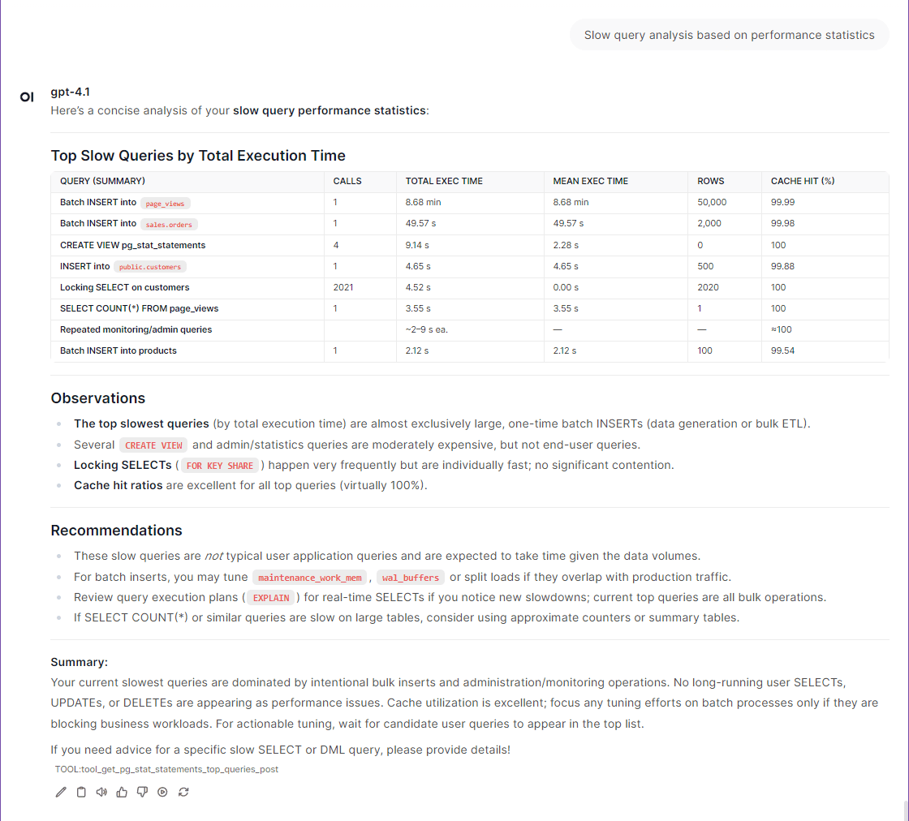
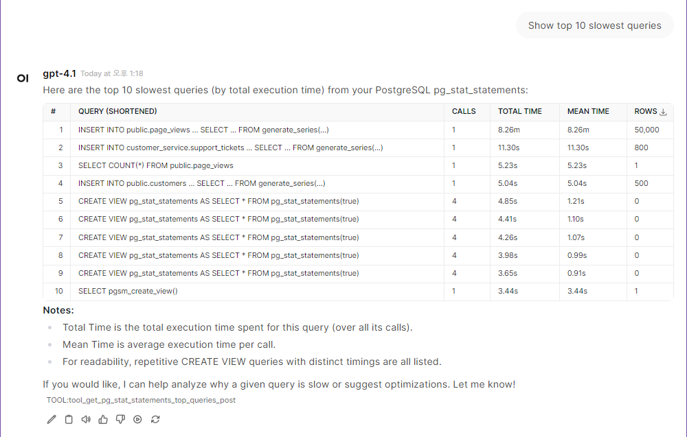
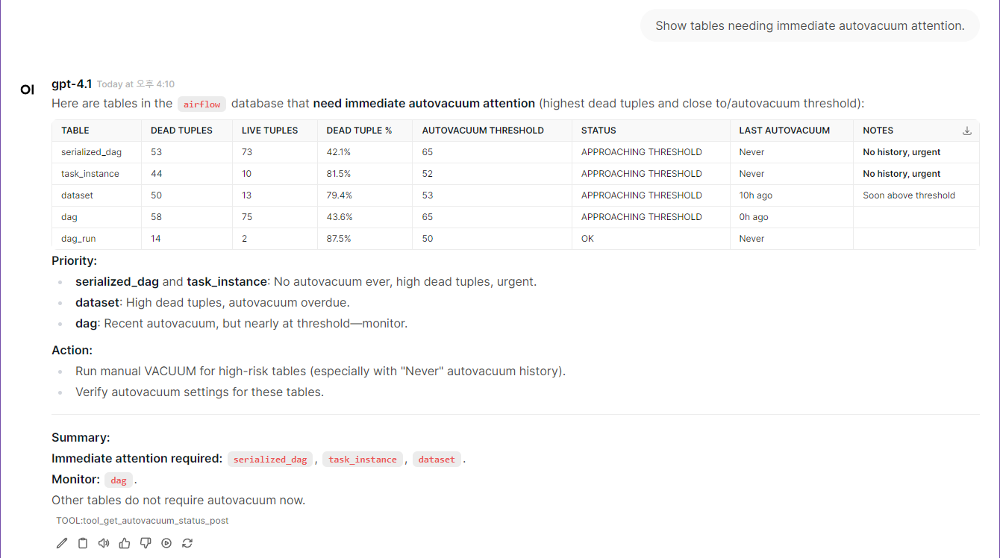
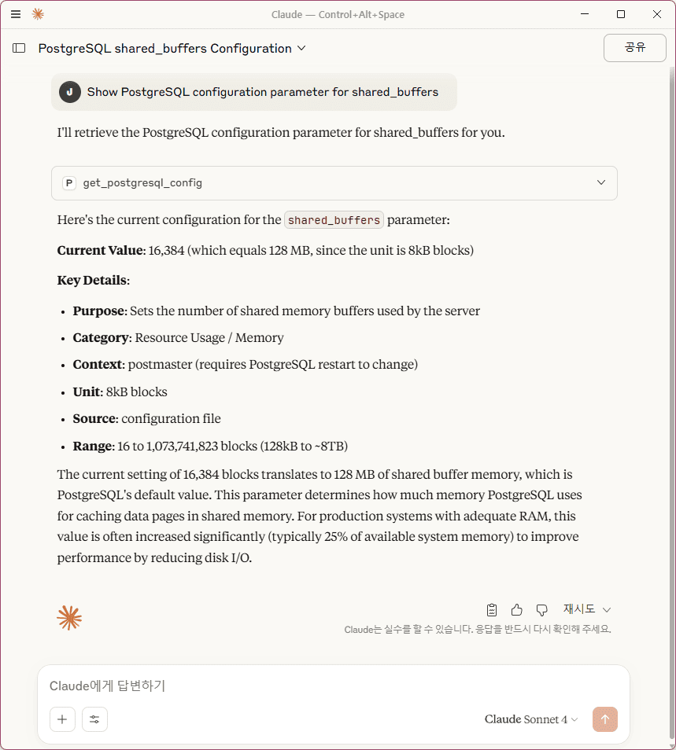
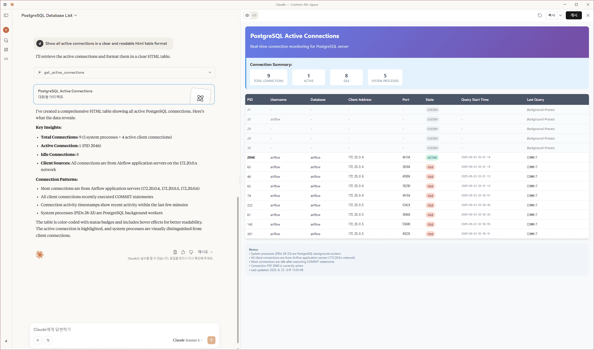
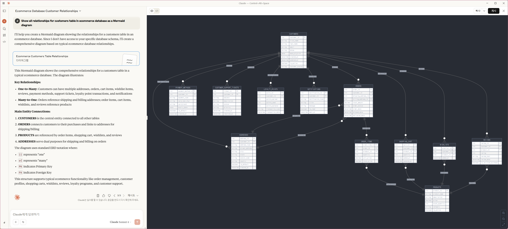
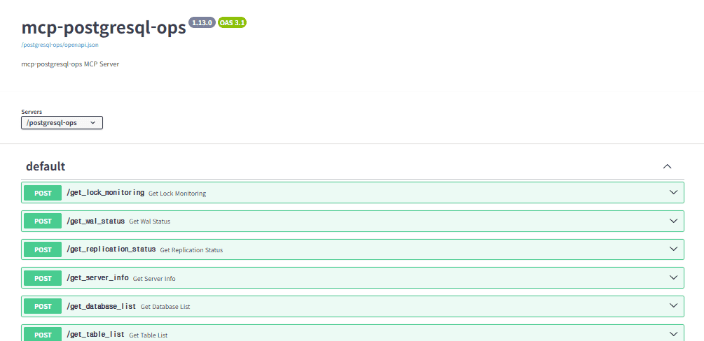

# MCP PostgreSQL Operations Server

[](https://github.com/call518/MCP-PostgreSQL-Ops/actions/workflows/pypi-publish.yml)

A professional MCP server for PostgreSQL database server operations, monitoring, and management. Most features work independently, but advanced performance analysis capabilities are available when the `pg_stat_statements` and (optionally) `pg_stat_monitor` extensions are installed.

## Features

- ✅ **Version Compatibility**: Transparent PostgreSQL version support (12-17) - automatically detects your PostgreSQL version and adapts functionality accordingly with zero configuration
- ✅ **PostgreSQL Monitoring**: Performance analysis based on pg_stat_statements and pg_stat_monitor with full backward compatibility
- ✅ **Structure Exploration**: Database, table, and user listing with detailed schema information
- ✅ **Schema Analysis**: Detailed table structure with columns, constraints, indexes, and relationships
- ✅ **Performance Analysis**: Slow query identification and index usage analysis with version-aware query optimization
- ✅ **Capacity Management**: Database and table size analysis
- ✅ **Bloat Analysis**: Table bloat monitoring and dead tuple analysis with maintenance recommendations
- ✅ **VACUUM/Autovacuum Analysis**: Comprehensive maintenance operation monitoring, effectiveness analysis, and real-time status tracking
- ✅ **Configuration Retrieval**: PostgreSQL configuration parameter verification
- ✅ **Database Performance Statistics**: Comprehensive transaction, I/O, and buffer cache analysis
- ✅ **I/O Performance Monitoring**: Version-aware I/O statistics (comprehensive on PG16+, basic on PG12-15)
- ✅ **Background Process Monitoring**: Version-aware checkpoint and background writer analysis (split on PG15+)
- ✅ **Table Statistics Monitoring**: Version-aware comprehensive table usage and maintenance statistics (enhanced vacuum tracking on PG13+)
- ✅ **Replication Monitoring**: Standby server conflict detection and replication lag analysis with version-compatible WAL status tracking
- ✅ **Function Performance Analysis**: User-defined function execution statistics
- ✅ **Query Performance Analysis**: Version-compatible pg_stat_statements integration (PG12: total_time mapping, PG13+: native columns)
- ✅ **Safe Read-Only**: All operations are read-only and safe

- 🛠️ **Easy Customization**: Simple and clean codebase makes it very easy to add new tools or customize existing ones

## Tool Usage Examples

### 📸 **[More Examples with Screenshots →](https://github.com/call518/MCP-PostgreSQL-Ops/wiki/Tool-Usage-Example)**

---



---



---



---

## ⭐ Quickstart (5 minutes)

> **Note:** The `postgresql` container included in `docker-compose.yml` is intended for quickstart testing purposes only. You can connect to your own PostgreSQL instance by adjusting the environment variables as needed.

> **If you want to use your own PostgreSQL instance instead of the built-in test container:**
> - Update the target PostgreSQL connection information in your `.env` file (see POSTGRES_HOST, POSTGRES_PORT, POSTGRES_USER, POSTGRES_PASSWORD, POSTGRES_DB).
> - In `docker-compose.yml`, comment out (disable) the `postgres` and `postgres-init-extensions` containers to avoid starting the built-in test database.

### 1. Environment Setup

> **Note**: While superuser privileges provide access to all databases and system information, the MCP server also works with regular user permissions for basic monitoring tasks.

```bash
git clone https://github.com/call518/MCP-PostgreSQL-Ops.git
cd MCP-PostgreSQL-Ops

### Check and modify .env file
cp .env.example .env

### No need to modify defaults, but if using your own PostgreSQL server, edit below:
POSTGRES_HOST=host.docker.internal
POSTGRES_PORT=15432
POSTGRES_USER=postgres
POSTGRES_PASSWORD=changeme!@34
POSTGRES_DB=ecommerce # Default connection DB. Superusers can access all DBs.
```

### 2. Start Demo Containers

```bash
# Start all containers including built-in PostgreSQL for testing
docker-compose up -d

# Alternative: If using your own PostgreSQL instance
# Comment out postgres and postgres-init-extensions services in docker-compose.yml
# Then use the custom configuration:
# docker-compose -f docker-compose.custom-db.yml up -d
```

### 3. Access to OpenWebUI

http://localhost:3003/

- The list of MCP tool features provided by `swagger` can be found in the MCPO API Docs URL.
  - e.g: `http://localhost:8003/docs`

### 4. Registering the Tool in OpenWebUI

1. logging in to OpenWebUI with an admin account
1. go to "Settings" → "Tools" from the top menu.
1. Enter the `postgresql-ops` Tool address (e.g., `http://localhost:8003/postgresql-ops`) to connect MCP Tools.
1. Setup Ollama or OpenAI.

---

## Tool Compatibility Matrix

> **Automatic Adaptation:** All tools work transparently across supported versions - no configuration needed!

### 🟢 **Extension-Independent Tools (No Extensions Required)**

| Tool Name | Extensions Required | PG 12 | PG 13 | PG 14 | PG 15 | PG 16 | PG 17 | System Views/Tables Used |
|-----------|-------------------|-------|-------|-------|-------|-------|-------|--------------------------|
| `get_server_info` | ❌ None | ✅ | ✅ | ✅ | ✅ | ✅ | ✅ | `version()`, `pg_extension` |
| `get_active_connections` | ❌ None | ✅ | ✅ | ✅ | ✅ | ✅ | ✅ | `pg_stat_activity` |
| `get_postgresql_config` | ❌ None | ✅ | ✅ | ✅ | ✅ | ✅ | ✅ | `pg_settings` |
| `get_database_list` | ❌ None | ✅ | ✅ | ✅ | ✅ | ✅ | ✅ | `pg_database` |
| `get_table_list` | ❌ None | ✅ | ✅ | ✅ | ✅ | ✅ | ✅ | `information_schema.tables` |
| `get_table_schema_info` | ❌ None | ✅ | ✅ | ✅ | ✅ | ✅ | ✅ | `information_schema.*`, `pg_indexes` |
| `get_database_schema_info` | ❌ None | ✅ | ✅ | ✅ | ✅ | ✅ | ✅ | `pg_namespace`, `pg_class`, `pg_proc` |
| `get_table_relationships` | ❌ None | ✅ | ✅ | ✅ | ✅ | ✅ | ✅ | `information_schema.*` (constraints) |
| `get_user_list` | ❌ None | ✅ | ✅ | ✅ | ✅ | ✅ | ✅ | `pg_user`, `pg_roles` |
| `get_index_usage_stats` | ❌ None | ✅ | ✅ | ✅ | ✅ | ✅ | ✅ | `pg_stat_user_indexes` |
| `get_database_size_info` | ❌ None | ✅ | ✅ | ✅ | ✅ | ✅ | ✅ | `pg_database_size()` |
| `get_table_size_info` | ❌ None | ✅ | ✅ | ✅ | ✅ | ✅ | ✅ | `pg_total_relation_size()` |
| `get_vacuum_analyze_stats` | ❌ None | ✅ | ✅ | ✅ | ✅ | ✅ | ✅ | `pg_stat_user_tables` |
| `get_current_database_info` | ❌ None | ✅ | ✅ | ✅ | ✅ | ✅ | ✅ | `pg_database`, `current_database()` |
| `get_table_bloat_analysis` | ❌ None | ✅ | ✅ | ✅ | ✅ | ✅ | ✅ | `pg_stat_user_tables` |
| `get_database_bloat_overview` | ❌ None | ✅ | ✅ | ✅ | ✅ | ✅ | ✅ | `pg_stat_user_tables` |
| `get_autovacuum_status` | ❌ None | ✅ | ✅ | ✅ | ✅ | ✅ | ✅ | `pg_stat_user_tables` |
| `get_autovacuum_activity` | ❌ None | ✅ | ✅ | ✅ | ✅ | ✅ | ✅ | `pg_stat_user_tables` |
| `get_running_vacuum_operations` | ❌ None | ✅ | ✅ | ✅ | ✅ | ✅ | ✅ | `pg_stat_activity` |
| `get_vacuum_effectiveness_analysis` | ❌ None | ✅ | ✅ | ✅ | ✅ | ✅ | ✅ | `pg_stat_user_tables` |
| `get_table_bloat_analysis` | ❌ None | ✅ | ✅ | ✅ | ✅ | ✅ | ✅ | `pg_stat_user_tables` |
| `get_database_bloat_overview` | ❌ None | ✅ | ✅ | ✅ | ✅ | ✅ | ✅ | `pg_stat_user_tables` |
| `get_lock_monitoring` | ❌ None | ✅ | ✅ | ✅ | ✅ | ✅ | ✅ | `pg_locks`, `pg_stat_activity` |
| `get_wal_status` | ❌ None | ✅ | ✅ | ✅ | ✅ | ✅ | ✅ | `pg_current_wal_lsn()` |
| `get_database_stats` | ❌ None | ✅ | ✅ | ✅ | ✅ | ✅ | ✅ | `pg_stat_database` |
| `get_table_io_stats` | ❌ None | ✅ | ✅ | ✅ | ✅ | ✅ | ✅ | `pg_statio_user_tables` |
| `get_index_io_stats` | ❌ None | ✅ | ✅ | ✅ | ✅ | ✅ | ✅ | `pg_statio_user_indexes` |
| `get_database_conflicts_stats` | ❌ None | ✅ | ✅ | ✅ | ✅ | ✅ | ✅ | `pg_stat_database_conflicts` |

### 🚀 **Version-Aware Tools (Auto-Adapting)**

| Tool Name | Extensions Required | PG 12 | PG 13 | PG 14 | PG 15 | PG 16 | PG 17 | Special Features |
|-----------|-------------------|-------|-------|-------|-------|-------|-------|------------------|
| `get_io_stats` | ❌ None | ✅ Basic | ✅ Basic | ✅ Basic | ✅ Basic | ✅ **Enhanced** | ✅ **Enhanced** | PG16+: `pg_stat_io` support |
| `get_bgwriter_stats` | ❌ None | ✅ | ✅ | ✅ | ✅ **Special** | ✅ | ✅ | PG15: Separate checkpointer stats |
| `get_replication_status` | ❌ None | ✅ Compatible | ✅ **Enhanced** | ✅ **Enhanced** | ✅ **Enhanced** | ✅ **Enhanced** | ✅ **Enhanced** | PG13+: `wal_status`, `safe_wal_size`; PG16+: enhanced WAL receiver |
| `get_all_tables_stats` | ❌ None | ✅ Compatible | ✅ **Enhanced** | ✅ **Enhanced** | ✅ **Enhanced** | ✅ **Enhanced** | ✅ **Enhanced** | PG13+: `n_ins_since_vacuum` tracking for vacuum maintenance optimization |
| `get_user_functions_stats` | ⚙️ Config Required | ✅ | ✅ | ✅ | ✅ | ✅ | ✅ | Requires `track_functions=pl` |

### 🟡 **Extension-Dependent Tools (Extensions Required)**

| Tool Name | Required Extension | PG 12 | PG 13 | PG 14 | PG 15 | PG 16 | PG 17 | Notes |
|-----------|-------------------|-------|-------|-------|-------|-------|-------|-------|
| `get_pg_stat_statements_top_queries` | `pg_stat_statements` | ✅ **Compatible** | ✅ **Enhanced** | ✅ **Enhanced** | ✅ **Enhanced** | ✅ **Enhanced** | ✅ **Enhanced** | PG12: `total_time` → `total_exec_time`; PG13+: native `total_exec_time` |
| `get_pg_stat_monitor_recent_queries` | `pg_stat_monitor` | ✅ **Compatible** | ✅ **Enhanced** | ✅ **Enhanced** | ✅ **Enhanced** | ✅ **Enhanced** | ✅ **Enhanced** | PG12: `total_time` → `total_exec_time`; PG13+: native `total_exec_time` |

> **📋 PostgreSQL 18 Support**: PostgreSQL 18 is currently in beta phase and not yet supported by Percona Distribution PostgreSQL. Support will be added once PostgreSQL 18 reaches stable release and distribution support becomes available.

---

## Usage Examples

### Claude Desktop Integration
(Recommended) Add to your Claude Desktop configuration file:

```json
{
  "mcpServers": {
    "postgresql-ops": {
      "command": "uvx",
      "args": ["--python", "3.11", "mcp-postgresql-ops"],
      "env": {
        "POSTGRES_HOST": "127.0.0.1",
        "POSTGRES_PORT": "5432",
        "POSTGRES_USER": "postgres",
        "POSTGRES_PASSWORD": "passwd",
        "POSTGRES_DB": "testdb"
      }
    }
  }
}
```

"Show PostgreSQL configuration parameter for shared_buffers."


"Show all active connections in a clear and readable html table format."


"Show all relationships for customers table in ecommerce database as a Mermaid diagram."


(Optional) Run with Local Source:

```json
{
  "mcpServers": {
    "postgresql-ops": {
      "command": "uv",
      "args": ["run", "python", "-m", "src.mcp_postgresql_ops.mcp_main"],
      "cwd": "/path/to/MCP-PostgreSQL-Ops",
      "env": {
        "POSTGRES_HOST": "127.0.0.1",
        "POSTGRES_PORT": "5432",
        "POSTGRES_USER": "postgres",
        "POSTGRES_PASSWORD": "passwd",
        "POSTGRES_DB": "testdb"
      }
    }
  }
}
```

### Command Line Usage

#### /w Pypi and uvx (Recommended)

```bash
# Stdio mode
uvx --python 3.11 mcp-postgresql-ops \
  --type stdio

# HTTP mode
uvx --python 3.11 mcp-postgresql-ops
  --type streamable-http \
  --host 127.0.0.1 \
  --port 8080 \
  --log-level DEBUG
```

#### /w Local Source

```bash
# Stdio mode
PYTHONPATH=/path/to/MCP-PostgreSQL-Ops
python -m src.mcp_postgresql_ops.mcp_main \
  --type stdio

# HTTP mode
PYTHONPATH=/path/to/MCP-PostgreSQL-Ops
python -m src.mcp_postgresql_ops.mcp_main \
  --type streamable-http \
  --host 127.0.0.1 \
  --port 8080 \
  --log-level DEBUG
```

---

## Environment Variables

| Variable | Description | Default | Project Default |
|----------|-------------|---------|-----------------|
| `PYTHONPATH` | Python module search path for MCP server imports | - | `/app/src` |
| `MCP_LOG_LEVEL` | Server logging verbosity (DEBUG, INFO, WARNING, ERROR) | `INFO` | `INFO` |
| `FASTMCP_TYPE` | MCP transport protocol (stdio for CLI, streamable-http for web) | `stdio` | `streamable-http` |
| `FASTMCP_HOST` | HTTP server bind address (0.0.0.0 for all interfaces) | `127.0.0.1` | `0.0.0.0` |
| `FASTMCP_PORT` | HTTP server port for MCP communication | `8080` | `8080` |
| `PGSQL_VERSION` | PostgreSQL major version for Docker image selection | `17` | `17` |
| `POSTGRES_HOST` | PostgreSQL server hostname or IP address | `127.0.0.1` | `host.docker.internal` |
| `POSTGRES_PORT` | PostgreSQL server port number | `5432` | `15432` |
| `POSTGRES_USER` | PostgreSQL connection username (needs read permissions) | `postgres` | `postgres` |
| `POSTGRES_PASSWORD` | PostgreSQL user password (supports special characters) | `changeme!@34` | `changeme!@34` |
| `POSTGRES_DB` | Default database name for connections | `testdb` | `testdb` |
| `POSTGRES_MAX_CONNECTIONS` | PostgreSQL max_connections configuration parameter | `200` | `200` |
| `DOCKER_EXTERNAL_PORT_OPENWEBUI` | Host port mapping for Open WebUI container | `8080` | `3003` |
| `DOCKER_EXTERNAL_PORT_MCP_SERVER` | Host port mapping for MCP server container | `8080` | `18003` |
| `DOCKER_EXTERNAL_PORT_MCPO_PROXY` | Host port mapping for MCPO proxy container | `8000` | `8003` |

**Note**: `POSTGRES_DB` serves as the default target database for operations when no specific database is specified. In Docker environments, if set to a non-default name, this database will be automatically created during initial PostgreSQL startup.

---

## Prerequisites

### Required PostgreSQL Extensions

> For more details, see the [## Tool Compatibility Matrix](#tool-compatibility-matrix)

**Note**: Most MCP tools work without any PostgreSQL extensions. section below. Some advanced performance analysis tools require the following extensions:

```sql
-- Query performance statistics (required only for get_pg_stat_statements_top_queries)
CREATE EXTENSION IF NOT EXISTS pg_stat_statements;

-- Advanced monitoring (optional, used by get_pg_stat_monitor_recent_queries)
CREATE EXTENSION IF NOT EXISTS pg_stat_monitor;
```

**Quick Setup**: For new PostgreSQL installations, add to `postgresql.conf`:
```
shared_preload_libraries = 'pg_stat_statements'
```
Then restart PostgreSQL and run the CREATE EXTENSION commands above.

- `pg_stat_statements` is required only for slow query analysis tools.
- `pg_stat_monitor` is optional and used for real-time query monitoring.
- All other tools work without these extensions.

### Minimum Requirements
- PostgreSQL 12+ (tested with PostgreSQL 17)
- Python 3.11
- Network access to PostgreSQL server
- Read permissions on system catalogs

### Required PostgreSQL Configuration

**⚠️ Statistics Collection Settings**:
Some MCP tools require specific PostgreSQL configuration parameters to collect statistics. Choose one of the following configuration methods:

**Tools affected by these settings**:
- **get_user_functions_stats**: Requires `track_functions = pl` or `track_functions = all`
- **get_table_io_stats** & **get_index_io_stats**: More accurate timing with `track_io_timing = on`
- **get_database_stats**: Enhanced I/O timing with `track_io_timing = on`

**Verification**:
After applying any method, verify the settings:
```sql
SELECT name, setting, context FROM pg_settings WHERE name IN ('track_activities', 'track_counts', 'track_io_timing', 'track_functions') ORDER BY name;

       name       | setting |  context  
------------------+---------+-----------
 track_activities | on      | superuser
 track_counts     | on      | superuser
 track_functions  | pl      | superuser
 track_io_timing  | on      | superuser
(4 rows)
```

#### Method 1: postgresql.conf (Recommended for Self-Managed PostgreSQL)
Add the following to your `postgresql.conf`:

```ini
# Basic statistics collection (usually enabled by default)
track_activities = on
track_counts = on

# Required for function statistics tools
track_functions = pl    # Enables PL/pgSQL function statistics collection

# Optional but recommended for accurate I/O timing
track_io_timing = on    # Enables I/O timing statistics collection
```

Then restart PostgreSQL server.

#### Method 2: PostgreSQL Startup Parameters
For Docker or command-line PostgreSQL startup:

```bash
# Docker example
docker run -d \
  -e POSTGRES_PASSWORD=mypassword \
  postgres:17 \
  -c track_activities=on \
  -c track_counts=on \
  -c track_functions=pl \
  -c track_io_timing=on

# Direct postgres command
postgres -D /data \
  -c track_activities=on \
  -c track_counts=on \
  -c track_functions=pl \
  -c track_io_timing=on
```

#### Method 3: Dynamic Configuration (AWS RDS, Azure, GCP, Managed Services)
For managed PostgreSQL services where you cannot modify `postgresql.conf`, use SQL commands to change settings dynamically:

```sql
-- Enable basic statistics collection (usually enabled by default)
ALTER SYSTEM SET track_activities = 'on';
ALTER SYSTEM SET track_counts = 'on';

-- Enable function statistics collection (requires superuser privileges)
ALTER SYSTEM SET track_functions = 'pl';

-- Enable I/O timing statistics (optional but recommended)
ALTER SYSTEM SET track_io_timing = 'on';

-- Reload configuration without restart (run separately)
SELECT pg_reload_conf();
```

**Alternative for session-level testing**:
```sql
-- Set for current session only (temporary)
SET track_activities = 'on';
SET track_counts = 'on';
SET track_functions = 'pl';
SET track_io_timing = 'on';
```

**Note**: When using command-line tools, run each SQL statement separately to avoid transaction block errors.

---

## RDS/Aurora Compatibility

- This server is read-only and works with regular roles on RDS/Aurora. For advanced analysis enable pg_stat_statements; pg_stat_monitor is not available on managed engines.
- On RDS/Aurora, prefer DB Parameter Group over ALTER SYSTEM for persistent settings.
  ```sql
  -- Verify preload setting
  SHOW shared_preload_libraries;

  -- Enable extension in target DB
  CREATE EXTENSION IF NOT EXISTS pg_stat_statements;

  -- Recommended visibility for monitoring
  GRANT pg_read_all_stats TO <app_user>;
  ```

---

## Example Queries

### 🟢 익스텐션 불필요 도구 (항상 사용 가능)

- **get_server_info**
  - "PostgreSQL 서버 버전과 익스텐션 상태를 보여주세요."
  - "pg_stat_statements가 설치되어 있는지 확인해주세요."
- **get_active_connections**
  - "모든 활성 연결을 보여주세요."
  - "데이터베이스와 사용자별 현재 세션 목록을 보여주세요."
- **get_postgresql_config**
  - "PostgreSQL 설정 파라미터를 모두 보여주세요."
  - "메모리 관련 설정들을 찾아주세요."
- **get_database_list**
  - "모든 데이터베이스와 크기를 보여주세요."
  - "소유자 정보가 포함된 데이터베이스 목록을 보여주세요."
- **get_table_list**
  - "ecommerce 데이터베이스의 모든 테이블을 보여주세요."
  - "public 스키마의 테이블 크기를 보여주세요."
- **get_table_schema_info**
  - "ecommerce 데이터베이스의 customers 테이블에 대한 상세한 스키마 정보를 보여주세요."
  - "ecommerce 데이터베이스의 products 테이블에 대한 컬럼 세부사항과 제약조건을 확인해주세요."
- **get_database_schema_info**
  - "ecommerce 데이터베이스의 모든 스키마와 그 내용을 보여주세요."
  - "ecommerce 데이터베이스의 sales 스키마에 대한 자세한 정보를 확인해주세요."
- **get_table_relationships**
  - "ecommerce 데이터베이스의 customers 테이블의 모든 관계를 보여주세요."
  - "ecommerce 데이터베이스 전체의 관계 개요를 확인해주세요."
- **get_user_list**
  - "모든 데이터베이스 사용자와 역할을 보여주세요."
  - "특정 데이터베이스에 대한 사용자 권한을 보여주세요."
- **get_index_usage_stats**
  - "인덱스 사용 효율성을 분석해주세요."
  - "현재 데이터베이스에서 사용되지 않는 인덱스를 찾아주세요."
- **get_database_size_info**
  - "데이터베이스 용량 분석을 보여주세요."
  - "크기별로 가장 큰 데이터베이스들을 찾아주세요."
- **get_table_size_info**
  - "테이블과 인덱스 크기 분석을 보여주세요."
  - "특정 스키마에서 가장 큰 테이블들을 찾아주세요."
- **get_vacuum_analyze_stats**
  - "최근 VACUUM과 ANALYZE 작업을 보여주세요."
  - "VACUUM이 필요한 테이블 목록을 보여주세요."
- **get_current_database_info**
  - "현재 어떤 데이터베이스에 연결되어 있나요?"
  - "현재 데이터베이스 정보와 연결 세부사항을 보여주세요."
- **get_table_bloat_analysis**
  - "현재 데이터베이스의 테이블 블로트를 분석해주세요."
  - "VACUUM 유지보수가 필요한 높은 블로트를 가진 테이블들을 찾아주세요."
- **get_database_bloat_overview**
  - "스키마별 데이터베이스 전체 블로트 요약을 보여주세요."
  - "모든 스키마의 스토리지 효율성에 대한 개괄적인 보기를 확인해주세요."
- **get_autovacuum_status**
  - "autovacuum 설정과 트리거 조건을 확인해주세요."
  - "즉시 autovacuum 주의가 필요한 테이블들을 보여주세요."
- **get_autovacuum_activity**
  - "지난 48시간 동안의 autovacuum 활동 패턴을 보여주세요."
  - "autovacuum 실행 빈도와 타이밍을 모니터링해주세요."
- **get_running_vacuum_operations**
  - "현재 실행 중인 VACUUM과 ANALYZE 작업을 보여주세요."
  - "활성 유지보수 작업과 진행상황을 모니터링해주세요."
- **get_vacuum_effectiveness_analysis**
  - "VACUUM 효과와 유지보수 패턴을 분석해주세요."
  - "수동 VACUUM과 autovacuum 효율성을 비교해주세요."
- **get_lock_monitoring**
  - "모든 현재 락과 차단된 세션을 보여주세요."
  - "granted=false 필터로 차단된 세션만 보여주세요."
- **get_wal_status**
  - "WAL 상태와 아카이빙 정보를 보여주세요."
  - "WAL 생성과 현재 LSN 위치를 모니터링해주세요."
- **get_replication_status**
  - "복제 연결과 지연 상태를 확인해주세요."
  - "복제 슬롯과 WAL receiver 상태를 모니터링해주세요."
- **get_database_stats**
  - "포괄적인 데이터베이스 성능 메트릭을 보여주세요."
  - "트랜잭션 커밋 비율과 I/O 통계를 분석해주세요."
- **get_bgwriter_stats**
  - "체크포인트 성능과 타이밍을 분석해주세요."
  - "백그라운드 라이터 효율성 통계를 보여주세요."
- **get_user_functions_stats**
  - "사용자 정의 함수 성능을 분석해주세요."
  - "함수 호출 횟수와 실행 시간을 보여주세요."
- **get_table_io_stats**
  - "테이블 I/O 성능과 버퍼 히트 비율을 분석해주세요."
  - "버퍼 캐시 성능이 낮은 테이블들을 찾아주세요."
- **get_index_io_stats**
  - "인덱스 I/O 성능과 버퍼 효율성을 보여주세요."
  - "과도한 디스크 I/O를 유발하는 인덱스들을 찾아주세요."
- **get_database_conflicts_stats**
  - "스탠바이 서버의 복제 충돌을 확인해주세요."
  - "충돌 유형과 해결 통계를 분석해주세요."

### 🚀 버전 적응형 도구 (자동 적응)

- **get_io_stats** (새로운 기능!)
  - "포괄적인 I/O 통계를 보여주세요." (PostgreSQL 16+에서 상세한 분석 제공)
  - "버퍼 캐시 효율성과 I/O 타이밍을 분석해주세요."
- **get_bgwriter_stats** (향상됨!)
  - "백그라운드 라이터와 체크포인트 성능을 보여주세요."
- **get_server_info** (향상됨!)
  - "서버 버전과 호환성 기능을 보여주세요."
  - "이 PostgreSQL 버전에서 사용 가능한 MCP 도구들을 확인해주세요."
- **get_all_tables_stats** (향상됨!)
  - "모든 테이블에 대한 포괄적인 통계를 보여주세요." (PG12-17 버전 호환)
  - "테이블 접근 패턴과 유지보수 필요사항을 분석해주세요."

### 🟡 익스텐션 의존 도구

- **get_pg_stat_statements_top_queries** (`pg_stat_statements` 필요)
  - "가장 느린 쿼리 상위 10개를 보여주세요."
  - "inventory 데이터베이스의 느린 쿼리를 분석해주세요."
- **get_pg_stat_monitor_recent_queries** (`pg_stat_monitor` 선택사항)
  - "최근 쿼리를 실시간으로 보여주세요."
  - "지난 5분간의 쿼리 활동을 모니터링해주세요."

**💡 Pro Tip**: All tools support multi-database operations using the `database_name` parameter. This allows PostgreSQL superusers to analyze and monitor multiple databases from a single MCP server instance.

---

## Troubleshooting

### Connection Issues
1. Check PostgreSQL server status
2. Verify connection parameters in `.env` file
3. Ensure network connectivity
4. Check user permissions

### Extension Errors
1. Run `get_server_info` to check extension status
2. Install missing extensions:
   ```sql
   CREATE EXTENSION pg_stat_statements;
   CREATE EXTENSION pg_stat_monitor;
   ```
3. Restart PostgreSQL if needed

### Configuration Issues
1. **"No data found" for function statistics**: Check `track_functions` setting
   ```sql
   SHOW track_functions;  -- Should be 'pl' or 'all'
   ```
   
   **Quick fix for managed services (AWS RDS, etc.)**:
   ```sql
   ALTER SYSTEM SET track_functions = 'pl';
   SELECT pg_reload_conf();
   ```

2. **Missing I/O timing data**: Enable timing collection
   ```sql
   SHOW track_io_timing;  -- Should be 'on'
   ```
   
   **Quick fix**:
   ```sql
   ALTER SYSTEM SET track_io_timing = 'on';
   SELECT pg_reload_conf();
   ```

3. **Apply configuration changes**:
   - **Self-managed**: Add settings to `postgresql.conf` and restart server
   - **Managed services**: Use `ALTER SYSTEM SET` + `SELECT pg_reload_conf()`
   - **Temporary testing**: Use `SET parameter = value` for current session
   - Generate some database activity to populate statistics

### Performance Issues
1. Use `limit` parameters to reduce result size
2. Run monitoring during off-peak hours
3. Check database load before running analysis

### Version Compatibility Issues

> For more details, see the [## Tool Compatibility Matrix](#tool-compatibility-matrix)

1. **Run compatibility check first**:
   ```bash
   # "Use get_server_info to check version and available features"
   ```

2. **Understanding feature availability**:
   - **PostgreSQL 16-17**: All features available
   - **PostgreSQL 15+**: Separate checkpointer stats
   - **PostgreSQL 14+**: Parallel query tracking
   - **PostgreSQL 12-13**: Core functionality only

3. **If a tool shows "Not Available"**:
   - Feature requires newer PostgreSQL version
   - Tool will automatically use best available alternative
   - Consider upgrading PostgreSQL for enhanced monitoring

---

## Development

### Testing & Development

```bash
# Test with MCP Inspector
./scripts/run-mcp-inspector-local.sh

# Direct execution for debugging
python -m src.mcp_postgresql_ops.mcp_main --log-level DEBUG

# Test version compatibility (requires different PostgreSQL versions)
# Modify POSTGRES_HOST in .env to point to different versions

# Run tests (if you add any)
uv run pytest
```

### Version Compatibility Testing

The MCP server automatically adapts to PostgreSQL versions 12-17. To test across versions:

1. **Set up test databases**: Different PostgreSQL versions (12, 14, 15, 16, 17)
2. **Run compatibility tests**: Point to each version and verify tool behavior
3. **Check feature detection**: Ensure proper version detection and feature availability
4. **Verify fallback behavior**: Confirm graceful degradation on older versions

---

## Security Notes

- All tools are **read-only** - no data modification capabilities
- Sensitive information (passwords) are masked in outputs
- No direct SQL execution - only predefined queries
- Follows principle of least privilege

---

## Contributing

🤝 **Got ideas? Found bugs? Want to add cool features?**

We're always excited to welcome new contributors! Whether you're fixing a typo, adding a new monitoring tool, or improving documentation - every contribution makes this project better.

**Ways to contribute:**
- 🐛 Report issues or bugs
- 💡 Suggest new PostgreSQL monitoring features
- 📝 Improve documentation 
- 🚀 Submit pull requests
- ⭐ Star the repo if you find it useful!

**Pro tip:** The codebase is designed to be super friendly for adding new tools. Check out the existing `@mcp.tool()` functions in `mcp_main.py`.

---

## Example: MCPO Swagger APIs

> [MCPO Swagger URL] http://localhost:8003/postgresql-ops/docs



---

## License
Freely use, modify, and distribute under the **MIT License**.

---

## ⭐ Other Projects

**Other MCP servers by the same author:**

- [MCP-Ambari-API](https://github.com/call518/MCP-Ambari-API)
- [MCP-Airflow-API](https://github.com/call518/MCP-Airflow-API)
- [LogSentinelAI - LLB-Based Log Analyzer](https://github.com/call518/LogSentinelAI)